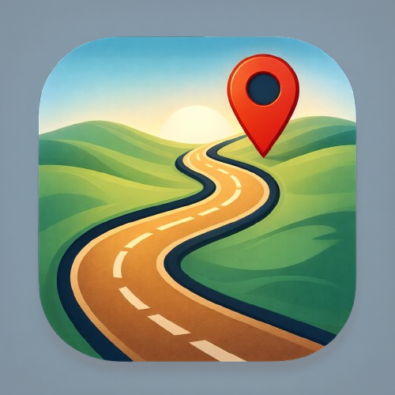
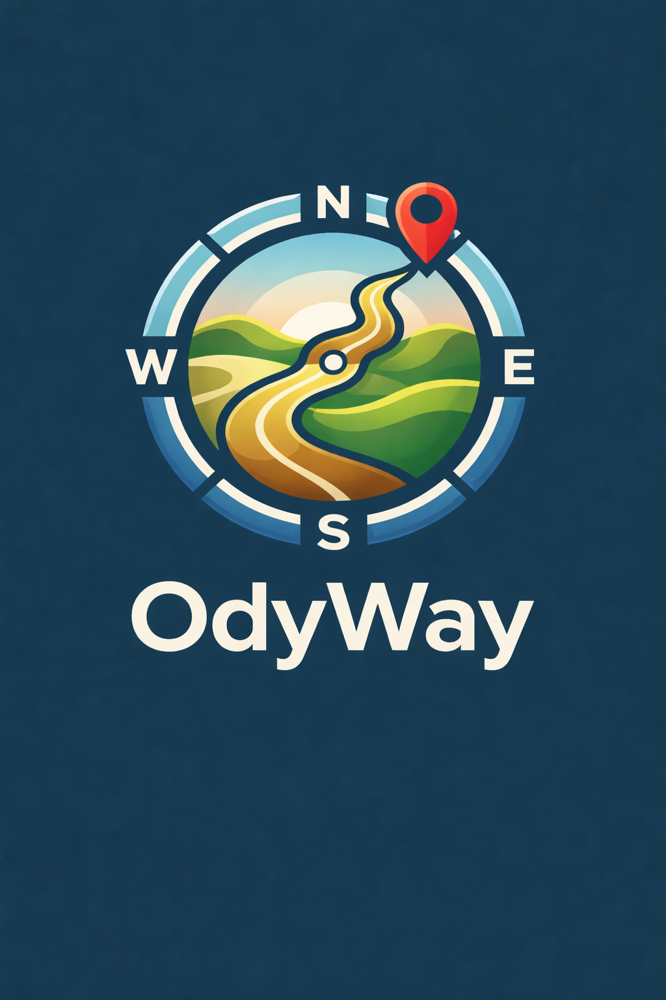

# Odyway

Benvingut a **Odyway**, l’app de gestió de viatges.

Hem triat el nom com la suma de la paraula odisea i el camí que seguiràs en els teus viatges!

---

## Logo de la App

Logo Principal

  

Splash Screen

  

---

## Sobre el Projecte

El projecte es desenvolupa seguint una **metodologia basada en sprints**, separant responsabilitats entre frontend i backend per simular un entorn professional real.

L’aplicació està construïda amb:

- **Kotlin + Jetpack Compose**
- Arquitectura per capes
- Separació clara entre lògica de negoci i interfície d’usuari
- Model de branques Git (`main`, `develop`, `feature/*`)

---

## Característiques Principals

1. **Planificació d’itineraris** – Organitza els teus viatges i visualitza el recorregut fàcilment
2. **Gestió de destinacions** – Afegeix llocs, dates i notes personalitzades
3. **Preferències d’usuari** – Personalitza l’experiència segons els teus interessos
4. **Arquitectura escalable** – Preparada per créixer amb noves funcionalitats

---

## Tecnologies Utilitzades

- **Kotlin** – Llenguatge principal de desenvolupament
- **Jetpack Compose** – Per a la interfície moderna i declarativa
- **Navigation Component** – Gestió fluida de pantalles
- **Material 3** – Disseny visual minimalista i coherent
- **Compatibilitat amb Android Oreo**

**Perque l'hem triat?** : Android Oreo és una versió estable i àmpliament utilitzada. Garanteix compatibilitat amb la majoria de dispositius sense renunciar a funcionalitats modernes.

---

## Metodologia de Treball

El projecte segueix un model de treball col·laboratiu:

- Cada funcionalitat es desenvolupa en una branca `feature/*`
- Les funcionalitats es fusionen a `develop`
- Quan la versió és estable, es publica a `main`
- Cada sprint inclou planificació, desenvolupament, revisió i retrospectiva

Això ens permet mantenir una estructura ordenada i professional.

---

## Equip de Desenvolupament

- **Xavier Giralt** – Backend i disseny d’arquitectura
- **Jonas Obando** – Frontend i disseny d’interfície

---
