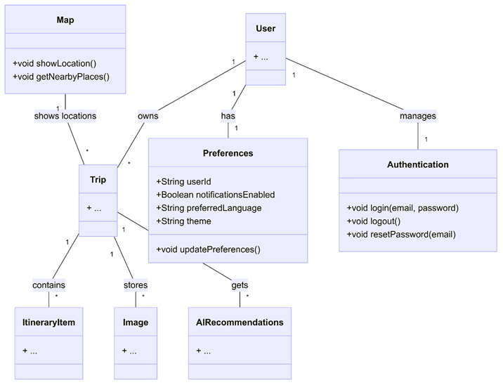

# Disseny de la app OdyWay

## 🏛️ Arquitectura General

Hem decitit que OdyWay segueixi una arquitectura en 3 capes per mantenir el codi ordenat i fàcil d’escalar:

- **UI (`/ui/`)**  
  Conté les pantalles (Jetpack Compose) i la navegació. Mostra informació i captura accions de l’usuari, però no guarda dades ni aplica lògica complexa.

- **Domain (`/domain/`)**  
  Conté el **model de domini** (classes com `Trip` o `Activity`) i altres funcions de calcul
  De moment hi ha funcionalitats futures marcades amb `@TODO`.

- **Data (`/data/`)**  
  Proporciona dades a l’app. De moment en aquest Sprint es treballa amb dades mock que mes endevant substituirem amb la API

## 📊 Model de dades

- **User**: representa l’usuari de l’app.
- **Preferences**: configuració de l’usuari (idioma, tema, notificacions…).
- **Authentication**: operacions d’autenticació (login/logout/reset).
- **Trip**: entitat principal del projecte. Conté informació del viatge i relacions amb:
  - **Activity**: activitats planificades amb cost i data/hora.
  - **ItineraryItem**: elements de l’itinerari (agenda del viatge).
  - **Image**: imatges associades al viatge.
- **Map**: funcions relacionades amb ubicacions i llocs propers

El diagrama següent reflecteix aquestes relacions i s’ha mantingut coherent amb les classes implementades a `app/domain/`.

