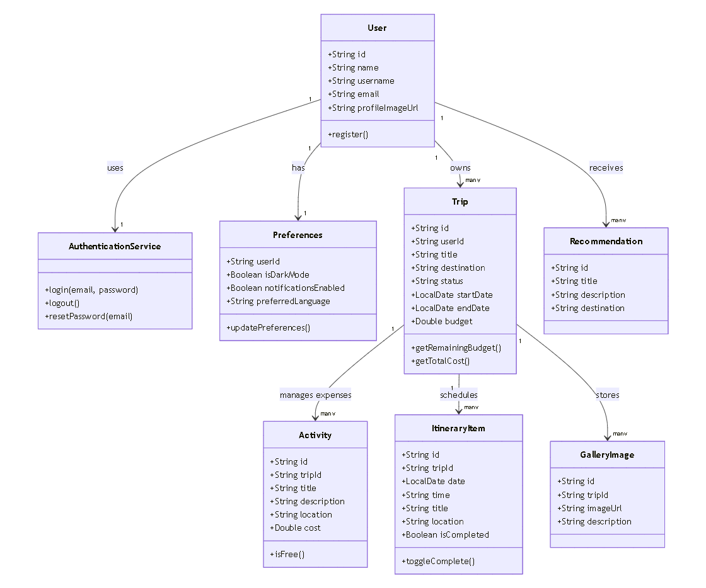

# Disseny de la app OdyWay

## Arquitectura General

Hem decidit que OdyWay segueixi una arquitectura robusta i escalable basada en els principis d'**Arquitectura Neta (Clean Architecture)** i el patró **MVVM (Model-View-ViewModel)** per mantenir el codi ordenat i fàcil d’escalar:

*   **UI (`/ui/`)**: Conté les pantalles construïdes amb **Jetpack Compose** i els **ViewModels**.
    *   *Screens:* Mostren informació, observen els estats reactius (`StateFlow`) i capturen les accions de l'usuari. No guarden dades ni apliquen lògica complexa.
    *   *ViewModels:* Connecten la UI amb el domini. Gestionen l'estat de la pantalla, executen validacions avançades i demanen dades als repositoris a través de corrutines.
*   **Domain (`/domain/`)**: Conté el model de negoci pur (classes d'alt nivell com `Trip` o `Activity`) i les **Interfícies dels Repositoris**. Aquesta capa no té cap dependència d'Android, assegurant la independència del negoci.
*   **Data (`/data/`)**: Gestiona tota la persistència i l'obtenció de dades reals.
    *   *Local:* Base de dades local implementada amb **Room SQLite**. Conté les Entitats, els `DAOs` i els `Mappers`. També utilitza `TypeConverters` per gestionar objectes com `LocalDate`.
    *   *Repository:* Implementacions reals dels repositoris (ex: `TripRepositoryImpl`, `AuthRepositoryImpl`). Apliquen el patró **Reactive Data Flow** (utilitzant `Flow` i `flatMapLatest`) per assegurar que la UI s'actualitzi en temps real. També s'integren amb serveis externs com **Firebase Authentication**.

**Injecció de Dependències:** Tota la gestió de dependències i la injecció de DAOs/Repositoris es fa mitjançant **Dagger Hilt**, configurat a la carpeta `/di/`.

---

## Estructura del Projecte
```plaintext
com.example.odyway/
├── ui/
│   ├── screens/          # Totes les pantalles de l'app (Home, Trips, Profile, etc.)
│   ├── viewmodels/       # Gestió d'estats i validacions (AuthViewModel, TripViewModel...)
│   ├── theme/            # Colors, tipografia i tema dinàmic
│   └── navigation/       # NavGraph i rutes (Gestió de backstack)
├── domain/               # Model pur (Trip, User...) i Interfícies (AuthRepository...)
├── data/
│   ├── local/            # Room Database
│   │   ├── dao/          # Consultes SQL (TripDao, UserAndLogDao, ItineraryDao)
│   │   ├── entity/       # Esquemes de base de dades
│   │   └── mapper/       # Conversió Entity <-> Domain
│   └── repository/       # Implementacions (AuthRepositoryImpl connectat a Firebase i Room)
└── di/                   # Mòduls de Hilt (AppModule, DatabaseModule, FirebaseModule)


## Esquema de Base de Dades (Room SQLite)

La persistència local gestiona les dades de l'usuari i els viatges per garantir un funcionament fluid. Les entitats principals són:

*   **Users (`users`)**: Emmagatzema les dades locals de l'usuari (sincronitzat amb l'autenticació Firebase).
    *   *Camps:* `id` (PK), `name`, `username`, `email`, `profileImageUrl`, `birthDate`, `login`, `address`, `country`, `phone`, `acceptEmails`.
    *   *Validacions:* Comprovació de noms d'usuari duplicats abans del registre.
*   **Trips (`trips`)**: Emmagatzema els viatges planificats.
    *   *Relació:* Existeix una Foreign Key entre `userId` i `users.id` per garantir que cada viatge pertanyi a un usuari vàlid.
    *   *Validacions Avançades:* Es validen dates congruents (inici <= fi) i s'eviten títols de viatges duplicats.
*   **Itinerary Items (`itinerary_items`)**: Emmagatzema l'agenda dels viatges.
    *   *Relació:* Existeix una Foreign Key cap a `trips.id`.
*   **Access Logs (`access_logs`)**: Registra l'activitat de seguretat de l'usuari.
    *   *Camps:* `id` (PK, autogenerat), `userId`, `timestamp`, `action` (LOGIN, REGISTER_LOGIN, LOGOUT).

---

## Autenticació (Firebase)

El sistema d'usuaris s'ha migrat a Firebase Auth. El procés és el següent:

1.  Creació del compte a Firebase i registre a Room.
2.  Tancament forçat de sessió inicial i enviament de correu de verificació.
3.  Comprovació de `isEmailVerified` abans de permetre el login.
4.  Suport per a restabliment de contrasenya (enviament d'email automàtic).

---

## Pantalles Implementades i Fluxos

### Flux d'Autenticació
*   **SplashScreen:** Logo de l'app, indicador de càrrega i versió. Redirecció automàtica segons l'estat de la sessió.
*   **LoginScreen:** Formulari d’inici de sessió (usuari + contrasenya) connectat a Firebase.
*   **RegisterScreen:** Formulari de registre d'usuaris amb validació de duplicats a Room i enviament d'email de verificació.
*   **RecoverPasswordScreen:** Pantalla dedicada per introduir l'email i enviar l'enllaç de recuperació via Firebase.

### Pestanyes Principals (Bottom Navigation)
*   **HomeScreen:** Panell principal, viatge actual ("LIVE"), propers viatges planificats i suggeriments de destins.
*   **TripsScreen:** Gestió de viatges amb pestanyes internes (Itinerari, Galeria, Costos).
*   **ProfileScreen:** Dades de l’usuari i estadístiques (Trips, Countries, Photos).

### Altres Pantalles (Settings Flow)
*   **SettingsScreen:** Opcions del compte, components reutilitzables (`SettingsItem`) i Funció de Logout (tanca la sessió a Firebase, enregistra l'acció a Room i neteja l'historial de navegació retornant al Login).
*   **PreferencesScreen:** Mode fosc, idioma i notificacions push.
*   **AboutScreen:** Informació de l’equip, llicència i detalls tècnics.
*   **TermsConditionsScreen:** Condicions d’ús amb scroll independent i botons d’acció.

---

## Model de Dades

L’aplicació gestiona les següents entitats principals al domini (`/domain/`):

*   **User:** ID, Nom complet, Nom d’usuari, Email, Foto de perfil.
*   **Preferences:** Idioma, Tema (clar/fosc), Notificacions.
*   **Trip:** Títol, Destinació, Pressupost, Estat, Dates d’inici i fi.
*   **Activity** *(Gestió de Pressupost)*: Títol, Descripció, Localització, Cost.
*   **ItineraryItem** *(Agenda)*: Data, Hora, Títol, Localització, Estat (Completat).
*   **GalleryImage:** URL, Descripció.
*   **Recommendation:** Suggeriments de destins per inspirar l’usuari.

---

## Relacions i Diagrama UML

*   Un **User** té unes úniques **Preferences**.
*   Un **User** posseeix múltiples **Trips** i genera múltiples **AccessLogs**.
*   Un **User** rep múltiples **Recommendations**.
*   Un **Trip** gestiona múltiples **Activities**.
*   Un **Trip** programa múltiples **ItineraryItems**.
*   Un **Trip** emmagatzema múltiples **GalleryImages**.

El diagrama següent reflecteix aquestes relacions i s’ha mantingut coherent amb les classes implementades a `app/domain/`.

